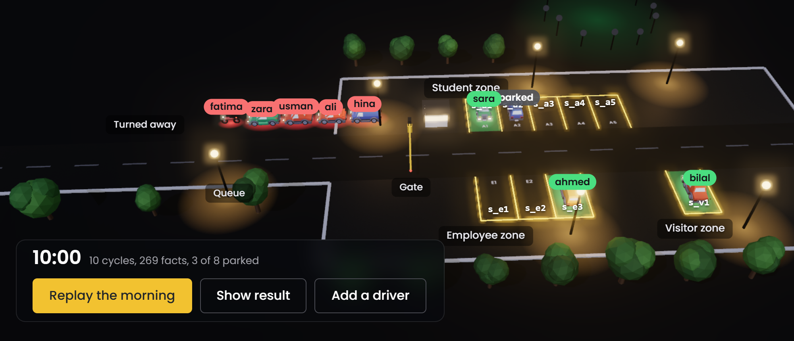

# Smart parking access and space allocation

[](https://github.com/ZainDev04/smart-parking-krr/actions/workflows/tests.yml)


[](LICENSE)
[](https://smart-parking-krr.vercel.app)

A rule-based reasoning system that decides who may park on a university campus, which bay each driver gets, and why everyone else was turned away. Built for CT-351 Knowledge Representation and Reasoning (Complex Computing Problem) at NED University of Engineering and Technology.



Live demo: https://smart-parking-krr.vercel.app. You can change the date and hour, or add your own driver, and the Python engine re-decides every request in your browser.

## The problem

Eight drivers reach the campus gate on a Friday morning. Whether each one may park depends on their role, their permit and its dates, the zone and its opening hours, whether the vehicle fits the bay, accessibility badges, reservations and who else wants the same bay. Gate staff apply these rules from memory and rarely tell a refused driver which rule stopped them.

This system makes the same decision from an explicit knowledge base and explains every refusal down to the stored fact that was missing:

```
$ python main.py why "allocate(fatima, s_e1)" -s tc06_no_suitable_space

allocate(fatima, s_e1) cannot be proved. Reasons, rule by rule:
  R28 blocked at can_allocate(fatima, s_e1)
    R19 blocked at eligible_for_space(fatima, s_e1)
      R15 blocked at suitable_space(fatima, s_e1)
        R14 blocked at fits(motorbike, standard)  (no such fact is stored)
```

Fatima has a valid staff permit and the employee zone is open, but she rides a motorbike and s_e1 is a car bay.

## How the knowledge is represented

One vocabulary, five representations, all generated from or checked against the same code:

| Representation | Where | What it holds |
| --- | --- | --- |
| Frames and a script | `krr/frames/` | 15 class frames with slots, facets, defaults and if-needed procedures; a ParkingSession script with seven scenes |
| Semantic network | `krr/semantic_net/` | is-a, has-a and part-of links, generated from the frames so the labels always match |
| First-order logic | `krr/logic/fol.py` | the policy with explicit quantifiers, plus twelve statements Horn clauses cannot express, checked on every run |
| Description logic | `krr/logic/description_logic.py` | a 45-axiom TBox with subsumption, restrictions and disjointness, and a reasoner that classifies it |
| Horn clauses | `krr/knowledge_base/rules.py` | the 28 rules and 7 integrity constraints that actually run |

The rules are written once, in Prolog syntax, in `rules.py`. Everything else (the SWI-Prolog program, the OWL ontology, the trace sheets, the report tables) is generated from them, so nothing can drift.

## How it reasons

- Forward chaining (`krr/reasoning/forward.py`) starts from the 164 facts of the main scenario and fires rules cycle by cycle until nothing new appears: 105 derived facts in 10 cycles. The one "unless" in the policy (a driver gets the bay unless someone with higher priority wants it) is handled with stratified negation as failure.
- Backward chaining (`krr/reasoning/backward.py`) proves a single goal by SLD resolution, records every step and returns a proof tree.
- The why-not explainer (`krr/reasoning/explain.py`) walks a failed goal back to the first condition that could not be met.

The two engines are written independently. The test suite checks that they derive exactly the same facts in every scenario.

## Quick start

The engine, CLI and tests use only the Python standard library, so a plain Python 3.10+ install is enough.

```
git clone https://github.com/ZainDev04/smart-parking-krr.git
cd smart-parking-krr
python main.py demo
```

Other commands:

```
python main.py                                  # interactive menu
python main.py forward                          # forward chaining trace, cycle by cycle
python main.py prove "allocate(sara, s_a1)"     # backward chaining with the full trace
python main.py why "allocate(usman, s_a1)"      # why a goal fails
python main.py cases                            # the 12 test cases through both engines
python main.py scenarios                        # list scenarios; pick one with -s NAME
```

There are also `kb`, `frames`, `network`, `fol`, `dl` and `script DRIVER SPACE`.

The Streamlit interface and the report build need the packages in `requirements.txt`:

```
pip install -r requirements.txt
streamlit run app.py
```

The generated Prolog program runs in [SWI-Prolog](https://www.swi-prolog.org) on its own:

```
swipl prolog/smart_parking.pl
?- allocate(sara, S).
S = s_a1.
?- show_allocations.
allocate(ahmed, s_e3)
allocate(bilal, s_v1)
allocate(sara, s_a1)
?- consistent.
true.
```

`python main.py prolog` loads the program for every scenario in SWI-Prolog and checks that it proves exactly what the Python engine derives:

```
  ok   morning_rush                      105 conclusions in Python,  105 in Prolog
  ok   tc01_valid_student                100 conclusions in Python,  100 in Prolog
  ...
  ok   tc12_inconsistent_abox            102 conclusions in Python,  102 in Prolog

13 scenarios, 0 differences.
```

## Tests

```
python -m unittest discover -s tests -v
```

70 tests cover the parser and unifier, every representation, both engines, the explainer, the website's scenario clock and added drivers, the check that forward and backward chaining agree, and the SWI-Prolog check above (skipped when swipl is not installed). GitHub Actions installs SWI-Prolog and runs everything on Python 3.10 and 3.12 on every push.

The twelve scenario test cases from the report:

| Case | Situation |
| --- | --- |
| TC1 | Valid student, valid permit, free student bay |
| TC2 | Expired permit |
| TC3 | Visitor without a pass |
| TC4 | Bay already occupied |
| TC5 | Student asks for an employee-only bay |
| TC6 | Eligible driver, but no suitable bay |
| TC7 | Three drivers want the same bay |
| TC8 | Accessible bay requested without a badge |
| TC9 | Conflicting reservations |
| TC10 | Visitor zone closed at 19:00 |
| TC11 | Reserved bay requested by someone else |
| TC12 | Inconsistent data: a student also recorded as faculty |

## The website

https://smart-parking-krr.vercel.app replays the morning rush in 3D (Three.js), with a flat 2D version for browsers without WebGL or when reduced motion is requested. Every decision, proof and count on the page comes from `tools/build_site.py`, which runs the engines and writes `website/data.js`.

Two features run the real engine in the browser through Pyodide, with no server involved:

- The scenario clock re-runs the scenario for any date and hour. At 23:00 every zone is closed; on 3 October 2026 Bilal's one-day visitor pass has expired.
- "Add a driver" turns a form into facts such as `student(omar)` and `requests(omar, s_a1, 905)` (`krr/site_export.py`), runs forward chaining again for everyone, and shows the new driver's proof.

The dark theme is a night scene; the light theme follows the clock with daylight and dusk.

## Project layout

```
krr/core/            terms, parser, unification, knowledge base
krr/knowledge_base/  facts, the 28 rules, integrity constraints, scenarios
krr/frames/          frame system, ontology, ParkingSession script
krr/semantic_net/    concept and instance networks
krr/logic/           FOL statements and the description logic reasoner
krr/reasoning/       forward chaining, backward chaining, why-not explanations
krr/export/          Prolog, OWL (Turtle) and Mermaid generators
krr/site_export.py   JSON export shared by the build and the website
app/, app.py         Streamlit interface
main.py              command-line interface
prolog/, ontology/   generated SWI-Prolog program and OWL 2 ontology (opens in Protege)
docs/report/         the CCP report (.docx, .pdf and its Markdown source)
docs/generated/      trace sheets used in the report
docs/figures/        report figures, drawn at print size by tools/figures.py
docs/viva/           viva guide, presentation script, and a Roman Urdu study guide (asaan_guide.pdf)
tools/               build scripts
website/             the project website
tests/               unit tests
```

To rebuild everything after changing a rule:

```
python tools/build_all.py              # traces, figures, Prolog, OWL, report and site data
python tools/build_all.py --no-render  # skip Mermaid rendering (needs Node.js)
python tools/build_all.py --no-report  # skip the Word report
```

On Windows with Word installed the build also fills in the report's contents pages and exports the PDF.

## Report

The full report (36 pages: domain analysis, frames, semantic network, FOL, description logic, Horn clauses, chaining traces, testing, and an expressivity and tractability analysis) is in [`docs/report/`](docs/report/) and can be downloaded from the website.

## Team

| Member | Roll no. | Part |
| --- | --- | --- |
| Syed Mohmmad Huzaifa | AI-23022 | Problem definition, knowledge acquisition, frames and scripts |
| Maaz ur Rehman | AI-23036 | Semantic network, description logic, expressivity and tractability |
| Owais Tariq | AI-23037 | First-order logic, Horn knowledge base, forward chaining |
| Shaikh Muhammad Zain | AI-23306 | Backward chaining, interfaces, tests, website and report integration |

Course instructor: Miss Dure Shahwar, Department of Computer Science and Information Technology, NED University.

## Credits

Car and traffic cone models: [Car Kit by Kenney](https://kenney.nl/assets/car-kit) (CC0). 3D rendering: [Three.js](https://threejs.org). Python in the browser: [Pyodide](https://pyodide.org).

## License

MIT. See [LICENSE](LICENSE).
